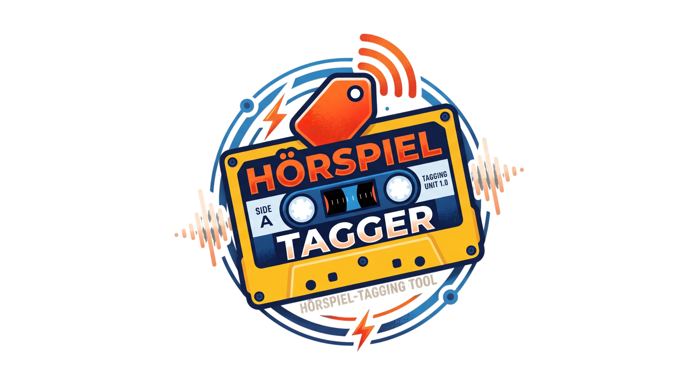

# Hörspiel Tagger

Hörspiel Tagger
Version: 1.6.8 | Developer: 3Draco

## License & Disclaimer
This project is licensed under the GNU General Public License v3.0 (GPL-3.0).

### Liability Notice
This software is provided "as is," without warranty of any kind, express or implied. In no event shall the authors or copyright holders be liable for any claim, damages, or other liability, whether in an action of contract, tort, or otherwise, arising from, out of, or in connection with the software or the use or other dealings in the software.

Use of this software is entirely at your own risk.

## Overview & Features

1. AI Metadata Cleaning
Automatically identifies series, episode numbers, album names, years, genres, and track titles via LM Studio, OpenAI, or compatible local servers.

2. Cover Art Manager & Cropping
Searches for high-resolution cover artwork via iTunes and MusicBrainz API, with an integrated interactive cropping tool before embedding.

3. Lossless Chapter Merge & Split
Losslessly merges MP3 tracks using FFmpeg (with embedded ID3v2.3 chapter marks) or splits audio dramas back into individual tracks by chapters.

4. Encrypted Local Settings
Automatically saves window positions and form configurations bound to your hardware key (`app_config.dat`).

5. Modern GUI & CLI
Easy-to-use CustomTkinter interface with drag-and-drop support, as well as CLI argument processing for automated workflows.

6. Local AI Ready
This tool works 100% offline and free of API costs using local LLM servers like **LM Studio** (`http://127.0.0.1:1234/v1`).

--------------------------------------------------------

Hörspiel Tagger
Version: 1.6.8 | Developer: 3Draco

+ Initial release with AI-powered tagging, lossless FFmpeg merge/split, CustomTkinter GUI, hardware-bound AES encryption, and iTunes/MusicBrainz cover search.

--------------------------------------------------------

If you enjoy my work and want to support this project, you can buy me a coffee!

